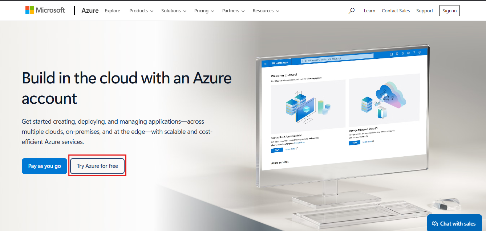
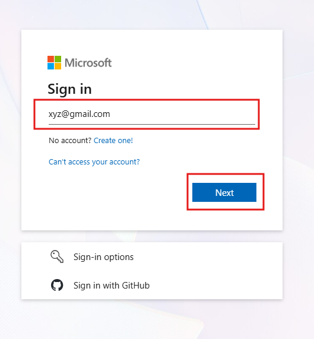
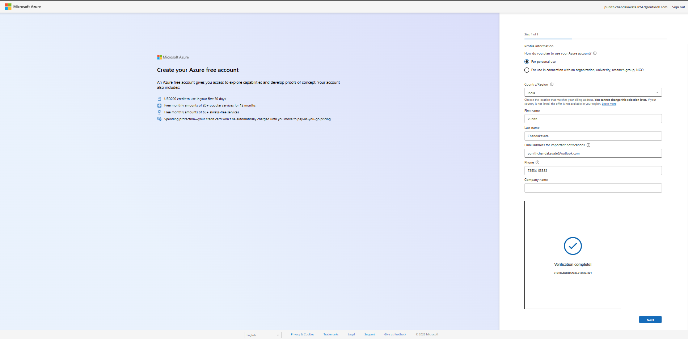
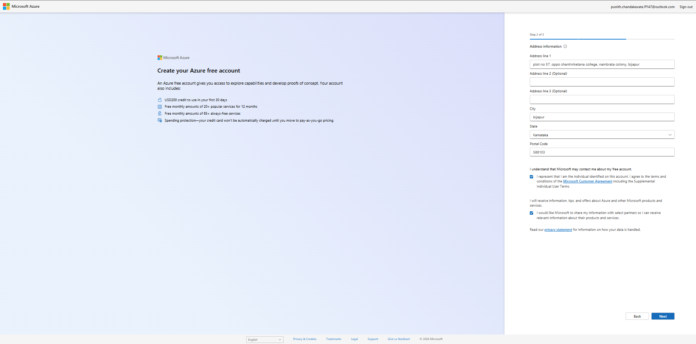
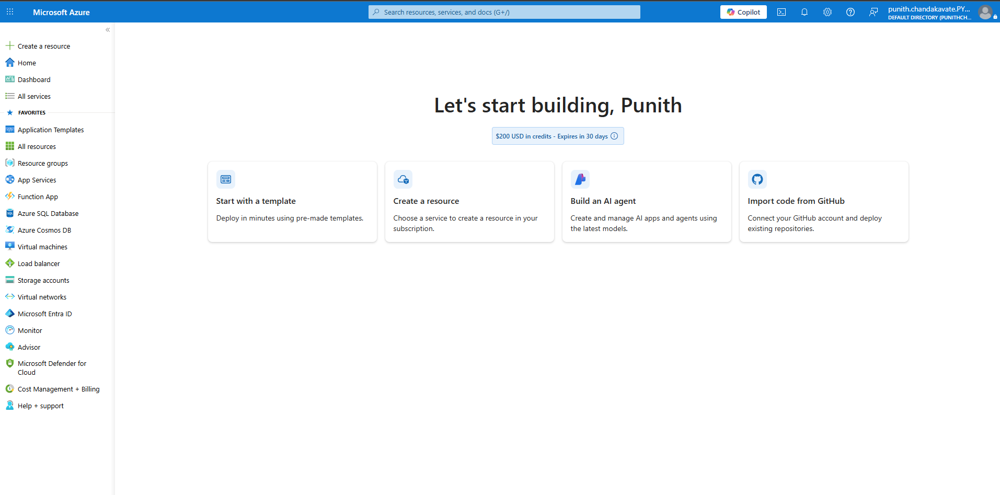

# 🚀 Azure Free Account Setup


---

# 📌 Project Overview

This guide demonstrates how to create an **Azure Free Account**, which provides access to Microsoft Azure cloud services for learning, development, and experimentation.

By following this guide, you will:

- Create a Microsoft Azure account
- Verify your identity
- Complete profile information
- Configure address details
- Access the Azure Portal
- Receive **USD 200 free credits** (eligible regions only)
- Start using Azure cloud services

---

# 🏗️ Architecture

```
User
   │
   ▼
Azure Website
   │
   ▼
Microsoft Account Sign In
   │
   ▼
Profile Verification
   │
   ▼
Address Information
   │
   ▼
Azure Subscription
   │
   ▼
Azure Portal Dashboard
```

---

# 📋 Prerequisites

Before creating an Azure account, ensure you have:

- Microsoft Account (Outlook/Hotmail/Gmail)
- Mobile Number
- Valid Address
- Credit/Debit Card (for identity verification if required)
- Internet Connection

---

# 📂 Steps to Create an Azure Free Account

---

# Step 1 — Open Azure Website

Visit the Azure website.

- Click **Try Azure for free**

> This option starts the Azure Free Account registration process.

<p align="center">
    
</p>

---

# Step 2 — Sign in with Microsoft Account

Enter your Microsoft email address.

Click **Next**.

<p align="center">
    
</p>

---

# Step 3 — Complete Profile Information

Provide the following details:

- Account Type
- Country/Region
- First Name
- Last Name
- Email Address
- Phone Number

Complete the verification process.

Click **Next**.

<p align="center">
    
</p>

---

# Step 4 — Enter Address Information

Fill in your address details.

Required information includes:

- Address
- City
- State
- Postal Code

Accept the Microsoft terms and conditions.

Click **Next**.

<p align="center">
    
</p>

---

# Step 5 — Azure Account Created Successfully

After successful verification, Azure creates your subscription.

You will be redirected to the Azure Portal dashboard.

You'll receive:

- ✅ Azure Free Subscription
- ✅ USD 200 Free Credits (eligible offers)
- ✅ Access to Azure Services

<p align="center">
    
</p>

---

# 💰 Azure Free Account Benefits

| Feature | Details |
|----------|---------|
| Free Credit | USD 200 (eligible offer) |
| Trial Period | 30 Days |
| Always Free Services | Available |
| Resource Management | Azure Portal |
| Learning Labs | Supported |

---

# ☁️ Azure Services You Can Explore

- Azure Virtual Machines
- Azure Storage Account
- Azure SQL Database
- Azure Databricks
- Azure Data Factory
- Azure Synapse Analytics
- Azure Functions
- Azure Kubernetes Service (AKS)
- Azure App Service
- Azure Monitor

---

