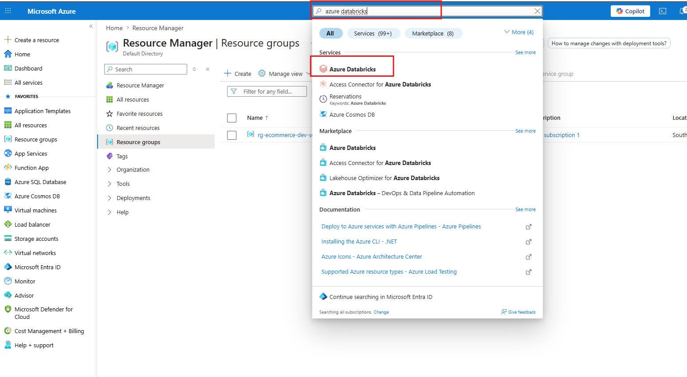
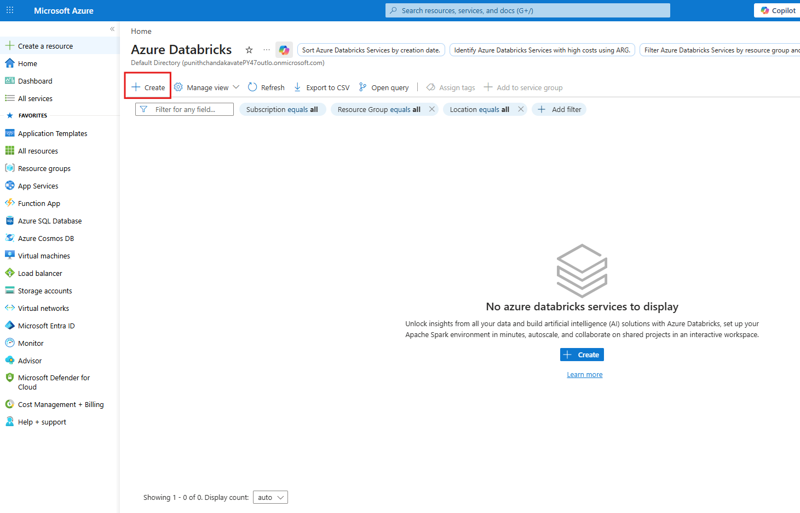
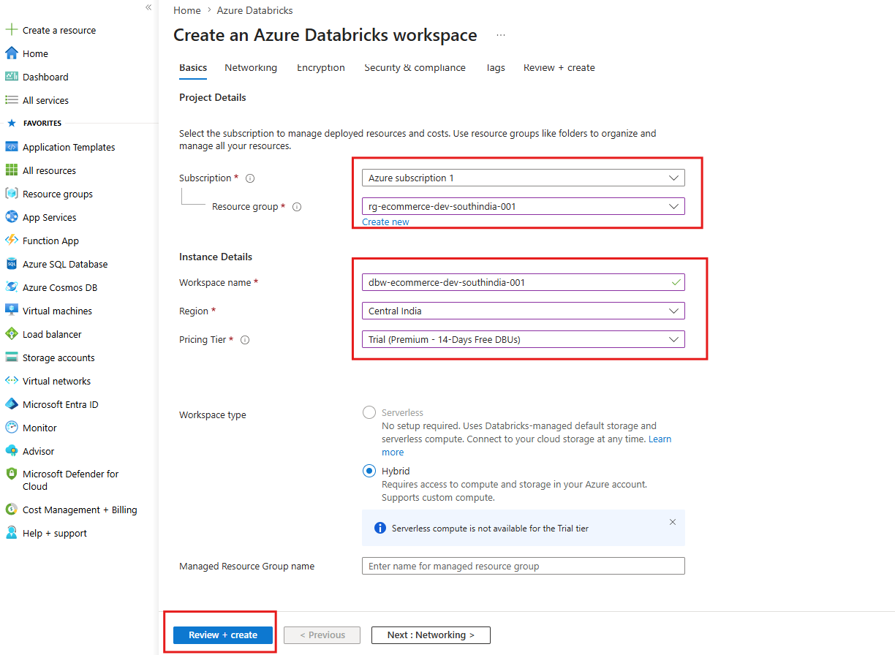
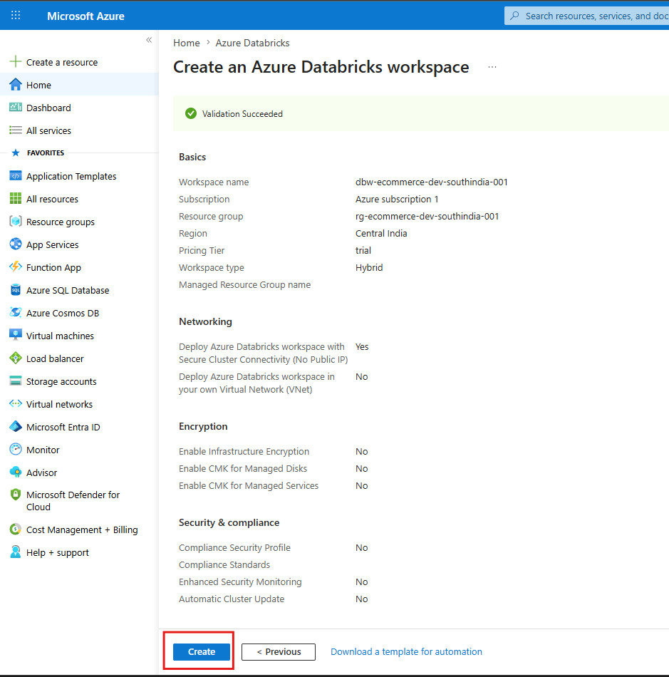
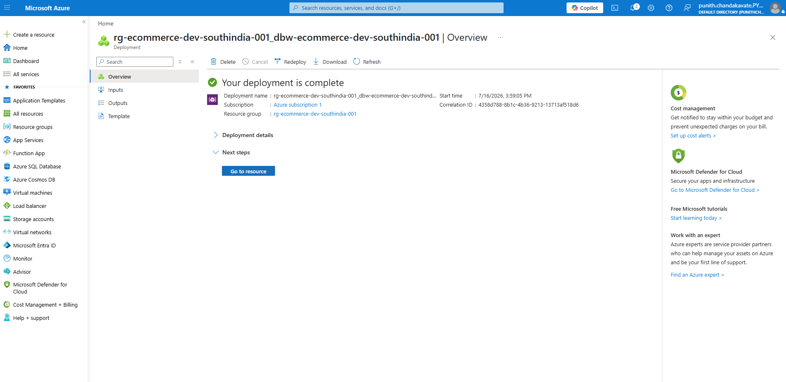
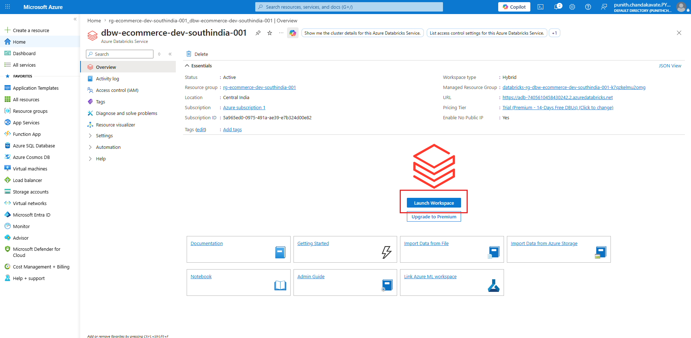
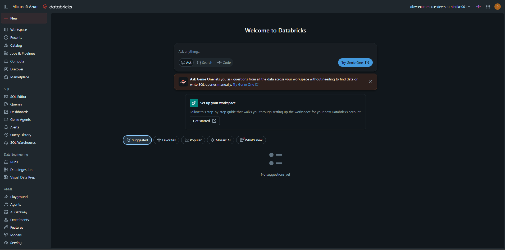
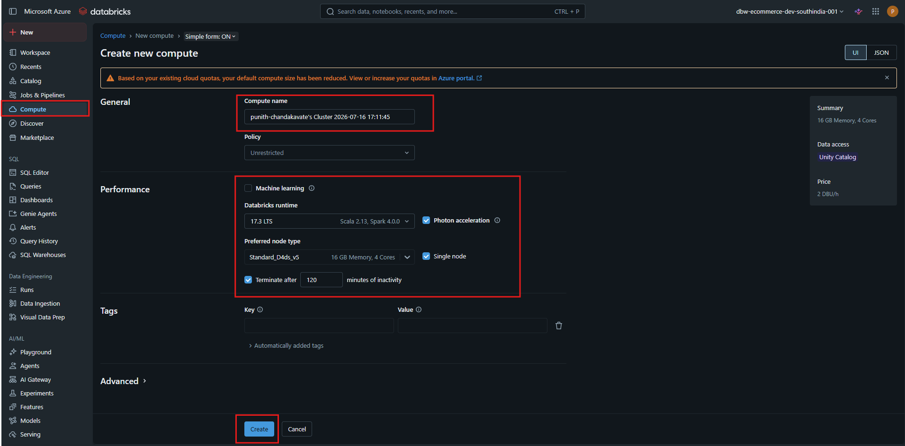

# 🚀 Azure Databricks Workspace Setup

---

# 📌 Project Overview

This guide walks you through creating and configuring an **Azure Databricks Workspace** using the Azure Portal. Azure Databricks is a cloud-based unified analytics platform built on Apache Spark that enables Data Engineering, Data Science, Machine Learning, and AI workloads.

By completing this guide, you will:

- Create a Resource Group
- Deploy an Azure Databricks Workspace
- Configure Workspace Settings
- Launch the Databricks Workspace
- Create your First Compute Cluster
- Prepare the environment for PySpark development

---

# 🏗️ Architecture

```text
Azure Subscription
        │
        ▼
Resource Group
        │
        ▼
Azure Databricks Workspace
        │
        ▼
Databricks Workspace
        │
        ▼
Compute Cluster
        │
        ▼
Notebook Development
        │
        ▼
Data Engineering Pipelines
```

---

# 📋 Prerequisites

Before creating an Azure Databricks Workspace, ensure you have:

- Azure Subscription
- Azure Free Account or Pay-As-You-Go Subscription
- Resource Group
- Internet Connection

---

# 📂 Step 1 — Create a Resource Group

Navigate to:

```
Azure Portal
    └── Resource Groups
            └── Create
```

Provide the following information:

| Property | Value |
|----------|-------|
| Subscription | Azure Subscription |
| Resource Group | rg-ecommerce-dev-southindia-001 |
| Region | South India |

Click **Review + Create**.

<p align="center">
    
</p>

---

# 📂 Step 2 — Search for Azure Databricks

From the Azure Portal search bar:

- Search **Azure Databricks**
- Select **Azure Databricks**

<p align="center">
    
</p>

---

# 📂 Step 3 — Create Azure Databricks Workspace

Click

```
Create
```

to deploy a new Azure Databricks Workspace.

<p align="center">
    
</p>

---

# 📂 Step 4 — Configure Workspace

Fill in the following details.

## Project Details

| Property | Value |
|----------|-------|
| Subscription | Azure Subscription |
| Resource Group | rg-ecommerce-dev-southindia-001 |

## Instance Details

| Property | Value |
|----------|-------|
| Workspace Name | dbw-ecommerce-dev-southindia-001 |
| Region | Central India |
| Pricing Tier | Trial (Premium - 14 Days Free DBUs) |
| Workspace Type | Hybrid |

Click

```
Review + Create
```

<p align="center">
    
</p>

---

# 📂 Step 5 — Validation

Azure validates your configuration.

Review all configuration settings.

Click

```
Create
```

<p align="center">
    
</p>

---

# 📂 Step 6 — Deployment Completed

Wait until Azure completes deployment.

Status should display:

```
Your deployment is complete
```

Click

```
Go to Resource
```

<p align="center">
    
</p>

---

# 📂 Step 7 — Launch Databricks Workspace

Inside the Azure Databricks resource page, click

```
Launch Workspace
```

This opens the Databricks web interface.

<p align="center">
    
</p>

---

# 📂 Step 8 — Azure Databricks Home

After launching, you'll see the Databricks workspace.

Available sections include:

- Workspace
- Catalog
- Jobs & Pipelines
- Compute
- SQL Editor
- Dashboards
- AI/ML
- Models
- Serving

<p align="center">
    
</p>

---

# 📂 Step 9 — Create Compute Cluster

Navigate to:

```
Compute
    └── Create Compute
```

Configure the cluster.

### General

| Property | Value |
|----------|-------|
| Compute Name | ecommerce-cluster |

### Performance

| Property | Value |
|----------|-------|
| Databricks Runtime | 17.3 LTS |
| Runtime Engine | Photon |
| Node Type | Standard_D4ds_v5 |
| Memory | 16 GB |
| vCPUs | 4 |
| Access Mode | Unity Catalog |
| Cluster Mode | Single Node |
| Auto Termination | 120 Minutes |

Click

```
Create
```

<p align="center">
    
</p>

---

# ✅ Deployment Summary

| Resource | Name |
|-----------|------|
| Resource Group | rg-ecommerce-dev-southindia-001 |
| Workspace | dbw-ecommerce-dev-southindia-001 |
| Pricing Tier | Trial Premium |
| Workspace Type | Hybrid |
| Runtime | Databricks Runtime 17.3 LTS |
| Node Type | Standard_D4ds_v5 |
| Memory | 16 GB |
| vCPUs | 4 |
| Compute Mode | Single Node |

---

# 📁 Resource Naming Convention

| Resource | Naming Pattern |
|----------|----------------|
| Resource Group | rg-<project>-<environment>-<region>-001 |
| Workspace | dbw-<project>-<environment>-<region>-001 |
| Cluster | cluster-<project>-001 |

Example:

```
rg-ecommerce-dev-southindia-001

dbw-ecommerce-dev-southindia-001

cluster-ecommerce-001
```

---

# 🎯 What You Learned

- Created an Azure Resource Group
- Deployed an Azure Databricks Workspace
- Configured Trial Premium Workspace
- Launched the Databricks Workspace
- Created a Single Node Compute Cluster
- Configured Databricks Runtime 17.3 LTS
- Prepared the environment for Spark and PySpark development

---


