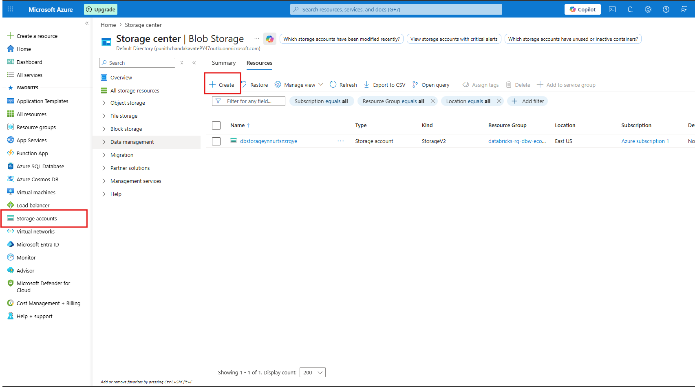
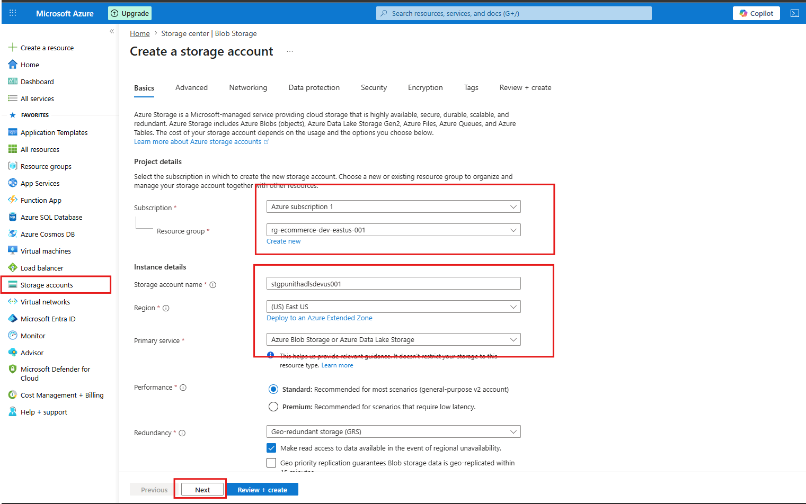
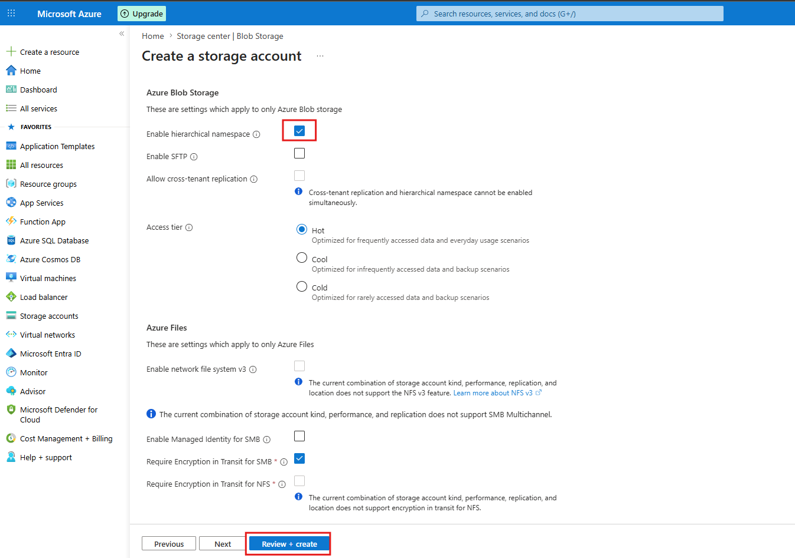
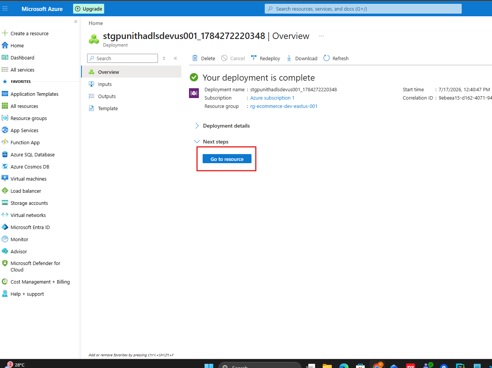
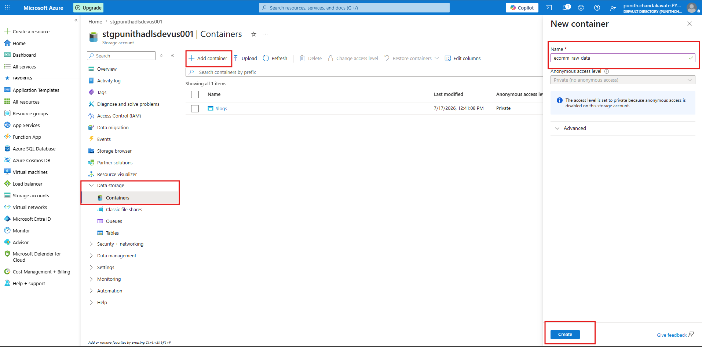
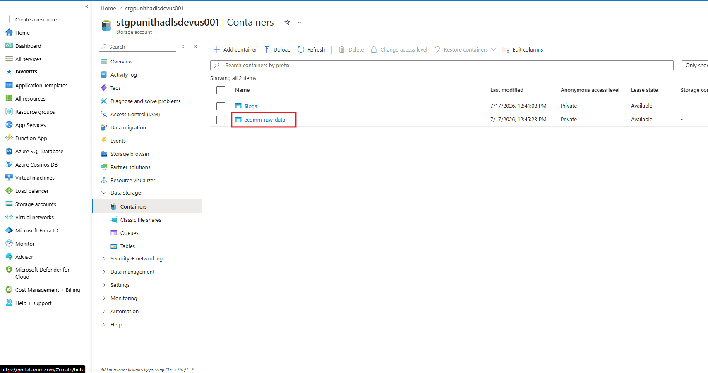
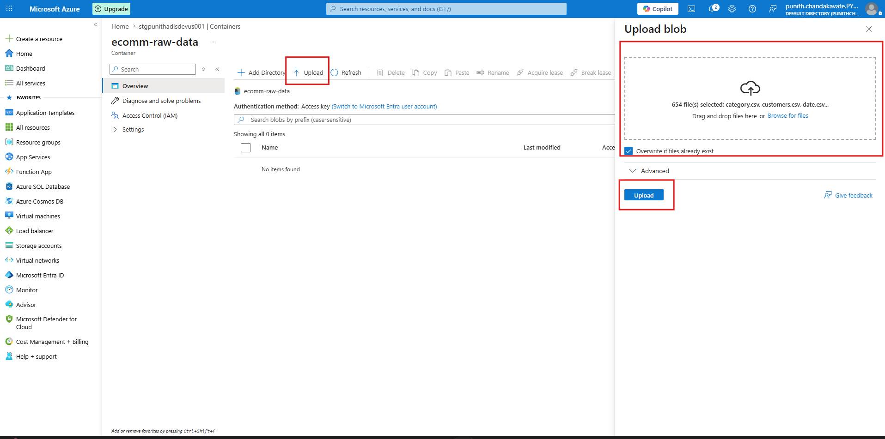
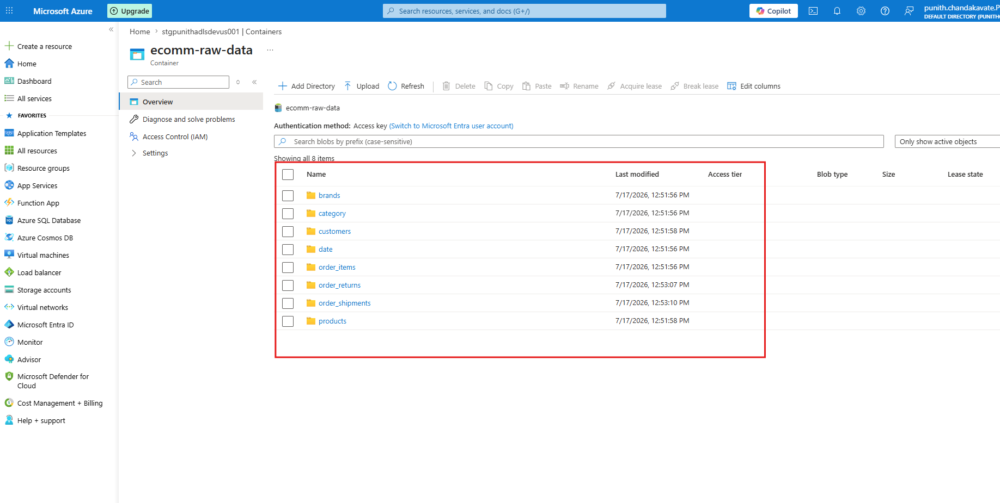

# 📦 Azure Data Lake Storage Gen2 (ADLS Gen2)


---

# 📖 Overview

Azure Data Lake Storage Gen2 (ADLS Gen2) is Microsoft's enterprise-grade cloud storage service designed for big data analytics workloads.

This guide walks through the complete setup process, including:

- Create Azure Storage Account
- Configure ADLS Gen2
- Enable Hierarchical Namespace
- Deploy Storage Account
- Create Blob Container
- Upload Dataset
- Verify Uploaded Files

---

# 🏗️ Architecture

```text
Azure Portal
      │
      ▼
Storage Account
      │
      ▼
Azure Data Lake Storage Gen2
      │
      ▼
Blob Container
      │
      ▼
CSV Files
      │
      ▼
Azure Databricks
```

---

# 📌 Step 1 — Create Azure Storage Account

Navigate to

```
Azure Portal

↓

Storage Accounts

↓

Create
```

Configure:

- Subscription
- Resource Group
- Storage Account Name
- Region
- Primary Service

<p align="center">

</p>

---

# 📌 Step 2 — Configure Storage Account

Configure the storage account with the following settings:

| Setting | Value |
|----------|------|
| Performance | Standard |
| Region | East US |
| Primary Service | Azure Blob Storage / ADLS |
| Redundancy | Geo-Redundant Storage (GRS) |

Click **Next**

<p align="center">

</p>

---

# 📌 Step 3 — Enable Azure Data Lake Storage Gen2

Enable the **Hierarchical Namespace**.

This converts Azure Blob Storage into **Azure Data Lake Storage Gen2**.

Configuration:

- ✅ Enable Hierarchical Namespace
- Access Tier = Hot

Click

```
Review + Create
```

<p align="center">

</p>

---

# 📌 Step 4 — Deploy Storage Account

Azure validates the configuration and deploys the storage account.

After deployment completes,

Click

```
Go to Resource
```

<p align="center">

</p>

---

# 📌 Step 5 — Create Blob Container

Navigate to

```
Storage Account

↓

Data Storage

↓

Containers

↓

Add Container
```

Container Name

```
ecomm-raw-data
```

Click

```
Create
```

<p align="center">

</p>

---

# 📌 Step 6 — Open the Container

Open the newly created container.

Container

```
ecomm-raw-data
```

You are now ready to upload the dataset.

<p align="center">

</p>

---

# 📌 Step 7 — Upload Dataset

Click

```
Upload
```

Drag & Drop your files or browse manually.

Example datasets

```
brands.csv
category.csv
customers.csv
date.csv
products.csv
order_items.csv
order_returns.csv
order_shipments.csv
```

Click

```
Upload
```

<p align="center">

</p>

---

# 📌 Step 8 — Verify Uploaded Files

After uploading, verify that all folders/files are available.

Expected Dataset

```
brands/

category/

customers/

date/

products/

order_items/

order_returns/

order_shipments/
```

<p align="center">

</p>

---

# 📂 Final Data Lake Structure

```text
Storage Account
│
└── ecomm-raw-data
    │
    ├── brands/
    ├── category/
    ├── customers/
    ├── date/
    ├── products/
    ├── order_items/
    ├── order_returns/
    └── order_shipments/
```

---

# ✅ Best Practices

- Use lowercase storage account names.
- Enable Hierarchical Namespace for Data Lake workloads.
- Use meaningful container names.
- Organize datasets into separate folders.
- Enable RBAC using Microsoft Entra ID.
- Enable Soft Delete and Versioning.
- Configure Lifecycle Management policies.
- Restrict public access to containers.
- Monitor storage usage using Azure Monitor.

---

# 🎯 Key Benefits

| Feature | Description |
|----------|-------------|
| 🚀 High Performance | Optimized for analytics workloads |
| 🔒 Secure | Microsoft Entra ID & RBAC |
| 📂 Hierarchical Namespace | Native folder support |
| 📈 Scalable | Petabyte-scale storage |
| 💰 Cost Optimized | Multiple storage tiers |
| ⚡ Analytics Ready | Integrates with Azure Databricks |

---

