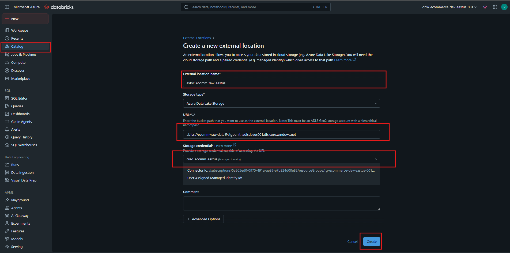
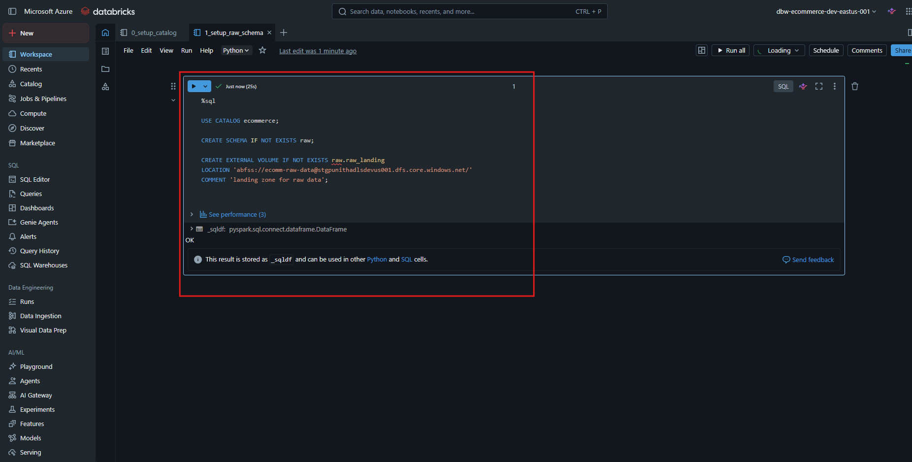

# 📂 Create Raw Schema and External Volume in Unity Catalog


---

# 📖 Overview

After configuring **Unity Catalog**, the next step is to connect your **Raw Data Landing Container** in Azure Data Lake Storage Gen2 to Unity Catalog.

This guide demonstrates how to:

- Create an **External Location** for the raw data container
- Create a **Raw Schema**
- Create an **External Volume**
- Prepare the Bronze (Raw) layer for data ingestion

The External Volume enables Unity Catalog to securely access raw datasets stored in Azure Data Lake Storage Gen2 using **Managed Identity**.

---

# 🎯 Learning Objectives

After completing this guide, you will be able to:

- Connect a Raw Data container with Unity Catalog
- Create an External Location
- Create a Raw Schema
- Create an External Volume
- Store structured, semi-structured, and unstructured files securely
- Prepare the Bronze Layer for ETL pipelines

---

# 🏗 Architecture

```text
                    Azure Data Lake Storage Gen2
                               │
                               ▼
                  Container : ecomm-raw-data
                               │
                               ▼
                 External Location (Unity Catalog)
                               │
                               ▼
                    Catalog : ecommerce
                               │
                               ▼
                      Schema : raw
                               │
                               ▼
            External Volume : raw.raw_landing
                               │
                               ▼
 CSV • JSON • Parquet • XML • LOG • Excel • Images
```

---

# 📂 Raw Landing Zone

The **ecomm-raw-data** container acts as the landing zone for all source system data.

Files are stored in their original format before any transformation.

Typical files include:

- CSV
- JSON
- Parquet
- XML
- TXT
- LOG
- Excel
- Images
- Other binary files

Example structure:

```text
ecomm-raw-data
│
├── customers/
│      ├── customers.csv
│
├── orders/
│      ├── orders.csv
│
├── products/
│      ├── products.json
│
├── inventory/
│      ├── inventory.parquet
│
├── application_logs/
│      ├── app.log
│
└── images/
       ├── product001.jpg
```

---

# 🚀 Step 1 — Create an External Location

Navigate to:

```text
Catalog
   ↓
External Locations
   ↓
Create External Location
```

Configure the External Location using the following values.

| Property | Value |
|----------|-------|
| External Location Name | exloc-ecomm-raw-eastus |
| Storage Type | Azure Data Lake Storage |
| URL | abfss://ecomm-raw-data@stgpunithadlsdevus001.dfs.core.windows.net |
| Storage Credential | cred-ecomm-eastus |

After entering all the required information, click **Create**.

<div align="center">



</div>

### 📌 Why create an External Location?

An External Location securely maps the **ecomm-raw-data** container to Unity Catalog.

Instead of using Storage Account Keys, Unity Catalog authenticates using the configured **Managed Identity** through the Storage Credential.

This enables secure, governed access to raw files for notebooks, jobs, and ETL pipelines.

---

# 🚀 Step 2 — Create Raw Schema and External Volume

Open a SQL Notebook and execute the following commands.

```sql
USE CATALOG ecommerce;

CREATE SCHEMA IF NOT EXISTS raw;

CREATE EXTERNAL VOLUME IF NOT EXISTS raw.raw_landing
LOCATION 'abfss://ecomm-raw-data@stgpunithadlsdevus001.dfs.core.windows.net/'
COMMENT 'Landing zone for raw data';
```

<div align="center">



</div>

### SQL Explanation

#### Select the Catalog

```sql
USE CATALOG ecommerce;
```

Sets **ecommerce** as the active Unity Catalog.

---

#### Create the Raw Schema

```sql
CREATE SCHEMA IF NOT EXISTS raw;
```

Creates the **raw** schema if it does not already exist.

The **raw** schema represents the **Bronze Layer** of the Medallion Architecture.

---

#### Create the External Volume

```sql
CREATE EXTERNAL VOLUME IF NOT EXISTS raw.raw_landing
LOCATION 'abfss://ecomm-raw-data@stgpunithadlsdevus001.dfs.core.windows.net/'
COMMENT 'Landing zone for raw data';
```

Creates an External Volume named **raw_landing** inside the **raw** schema.

The volume points directly to the **ecomm-raw-data** container in Azure Data Lake Storage Gen2.

This location stores incoming files exactly as they arrive from source systems.

After execution, the notebook should display:

```text
OK
```

This confirms that the schema and external volume have been created successfully.

---

# 📓 Databricks Notebook

This guide is implemented using the following Databricks notebook.

| Notebook                                                                        | Description                            |
|---------------------------------------------------------------------------------|----------------------------------------|
| [📘 Setup Raw Schema](../../notebooks/01_setup/02_setup_raw_schema.ipynb)       | Creates the Raw Schema                 |
| [📘 Create external volume](../../notebooks/01_setup/03_create_external_volume.ipynb) | Creates External Volume for the Bronze layer. |

---

## Notebook Overview

The notebook performs the following tasks:

- Select Unity Catalog
- Create the Raw Schema
- Create the External Volume
- Configure the Bronze Landing Zone
- Validate successful execution

----

# 📂 Final Resource Hierarchy

```text
Azure Subscription
│
├── Azure Databricks Workspace
│
├── Unity Catalog
│      │
│      └── ecommerce
│              │
│              └── raw
│                      │
│                      └── raw_landing
│
├── External Location
│      │
│      └── exloc-ecomm-raw-eastus
│
└── Azure Storage Account
        │
        └── ecomm-raw-data
                │
                ├── CSV
                ├── JSON
                ├── LOG
                ├── XML
                ├── Parquet
                ├── Excel
                └── Images
```

---

# 🔄 Data Flow

```text
Source Systems
      │
      ▼
CSV / JSON / XML / LOG / Images
      │
      ▼
Azure Data Lake Storage Gen2
(Container : ecomm-raw-data)
      │
      ▼
External Location
      │
      ▼
Unity Catalog
      │
      ▼
Schema : raw
      │
      ▼
External Volume : raw_landing
      │
      ▼
Bronze Layer
```

---

# ✅ Verification Checklist

| Component | Status |
|-----------|:------:|
| External Location Created | ✅ |
| Storage Credential Connected | ✅ |
| Raw Schema Created | ✅ |
| External Volume Created | ✅ |
| SQL Executed Successfully | ✅ |
| Raw Landing Zone Ready | ✅ |

---

# 💡 Best Practices

- Use a dedicated container for raw data.
- Store source files in their original format.
- Do not modify raw files.
- Organize files by source system.
- Use Managed Identity instead of Storage Account Keys.
- Apply Unity Catalog permissions to control access.
- Maintain separate Bronze, Silver, and Gold layers.
- Use descriptive names for schemas and volumes.

