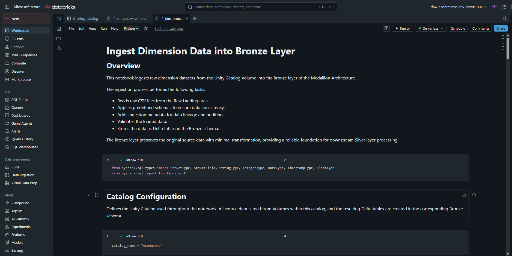
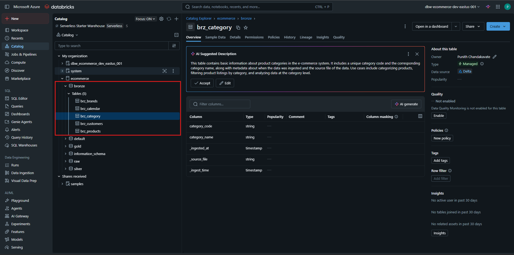

# 🥉 Ingest Dimension Data into Bronze Layer


---

# 📖 Overview

After creating the **Raw Schema** and **External Volume**, the next step is to ingest raw source files into the **Bronze Layer** of the Medallion Architecture.

This notebook reads raw datasets from the Unity Catalog Volume, validates the data using predefined schemas, enriches it with ingestion metadata, and stores it as Delta tables in the Bronze schema.

The Bronze layer preserves the original source data with minimal transformation, providing a reliable foundation for downstream Silver layer processing.

---

# 🎯 Learning Objectives

After completing this guide, you will be able to:

- Read raw files from Unity Catalog Volumes
- Apply predefined schemas during ingestion
- Add ingestion metadata for lineage and auditing
- Create Delta tables in the Bronze schema
- Validate successful data ingestion
- Prepare data for Silver layer transformations

---

# 🏗 Architecture

```text
                    Azure Data Lake Storage Gen2
                               │
                               ▼
                  Container : ecomm-raw-data
                               │
                               ▼
              Unity Catalog Volume : raw.raw_landing
                               │
                               ▼
                Bronze Ingestion Notebook
                               │
          ┌────────────────────┼────────────────────┐
          ▼                    ▼                    ▼
     Apply Schema       Add Metadata        Validate Data
                               │
                               ▼
                  Bronze Delta Tables
                               │
                               ▼
                 brz_brands
                 brz_calendar
                 brz_category
                 brz_customers
                 brz_products
```

---

# 📂 Source Data

The notebook reads raw dimension datasets stored in the **raw.raw_landing** volume.

Example directory structure:

```text
raw_landing
│
├── brands/
│      └── brands.csv
│
├── calendar/
│      └── calendar.csv
│
├── category/
│      └── category.csv
│
├── customers/
│      └── customers.csv
│
└── products/
       └── products.csv
```

---

# 🚀 Ingestion Process

The notebook performs the following tasks:

- Reads CSV files from the Raw Landing Zone
- Applies predefined Spark schemas
- Validates incoming data
- Adds ingestion metadata
- Writes Delta tables into the Bronze schema
- Overwrites existing tables when required

---

# 📊 Metadata Added

Each Bronze table contains additional metadata columns.

| Column | Description |
|---------|-------------|
| `_ingested_at` | Timestamp when the record was loaded |
| `_source_file` | Source file name |
| `_ingest_time` | Notebook execution timestamp |

These metadata columns help with:

- Data lineage
- Auditing
- Troubleshooting
- Incremental processing

---

# 📂 Bronze Tables Created

After successful execution, the following Delta tables are created.

| Bronze Table | Description |
|--------------|-------------|
| brz_brands | Product brand master data |
| brz_calendar | Calendar dimension |
| brz_category | Product category dimension |
| brz_customers | Customer master data |
| brz_products | Product master data |

---

# 🚀 Notebook Workflow

The notebook is organized into the following sections.

## 1. Import Required Libraries

Imports the required PySpark SQL modules.

```python
from pyspark.sql.types import *
from pyspark.sql import functions as F
```

---

## 2. Configure Unity Catalog

Defines the catalog used throughout the notebook.

```python
catalog_name = "ecommerce"
```

---

## 3. Define Source Paths

Specifies the raw landing location for each dataset stored in the Unity Catalog Volume.

Example:

```text
/Volumes/ecommerce/raw/raw_landing/category/
```

---

## 4. Define Schemas

Creates explicit Spark schemas for each dimension dataset.

Using predefined schemas ensures:

- Consistent data types
- Better performance
- Reduced schema inference overhead

---

## 5. Read CSV Files

Reads source files using Spark.

Example:

```python
spark.read.csv(...)
```

---

## 6. Add Metadata

Adds ingestion metadata columns before writing.

Example columns:

- _ingested_at
- _source_file
- _ingest_time

---

## 7. Write Bronze Tables

Writes data as managed Delta tables.

Example:

```python
df.write.format("delta") \
    .mode("overwrite") \
    .saveAsTable("ecommerce.bronze.brz_category")
```

---

# 📓 Databricks Notebook

This guide is implemented using the following notebook.

| Notebook                                                    | Description |
|-------------------------------------------------------------|-------------|
| [📘 2_dim_bronze.ipynb](../../notebooks/02_bronze/01_ingest_dimensions.ipynb) | Reads raw dimension datasets and creates Bronze Delta tables. |

---

# 📂 Final Resource Hierarchy

```text
Unity Catalog
│
└── ecommerce
      │
      ├── raw
      │      │
      │      └── raw_landing
      │
      └── bronze
             │
             ├── brz_brands
             ├── brz_calendar
             ├── brz_category
             ├── brz_customers
             └── brz_products
```

---

# 🔄 Data Flow

```text
Raw CSV Files
      │
      ▼
Unity Catalog Volume
(raw.raw_landing)
      │
      ▼
Bronze Notebook
      │
      ├── Read Files
      ├── Apply Schema
      ├── Validate Data
      ├── Add Metadata
      │
      ▼
Bronze Delta Tables
      │
      ▼
Silver Layer
```

---

# ✅ Verification Checklist

| Component | Status |
|-----------|:------:|
| Raw Files Read Successfully | ✅ |
| Schemas Applied | ✅ |
| Metadata Added | ✅ |
| Bronze Tables Created | ✅ |
| Delta Format Used | ✅ |
| Data Available in Catalog | ✅ |

---

# 📸 Notebook Execution

The notebook successfully ingests dimension datasets into the Bronze layer.

<div align="center">



</div>

---

# 📸 Bronze Tables

After execution, the tables are available in the **bronze** schema.

<div align="center">



</div>

---

# 💡 Best Practices

- Keep Bronze transformations minimal.
- Preserve source data as-is.
- Always use predefined schemas.
- Store data in Delta format.
- Include ingestion metadata for auditing.
- Use descriptive table names.
- Organize notebooks by ingestion layer.
- Validate data before loading into Silver.
- Partition large datasets where appropriate.
- Use Unity Catalog for centralized governance.

